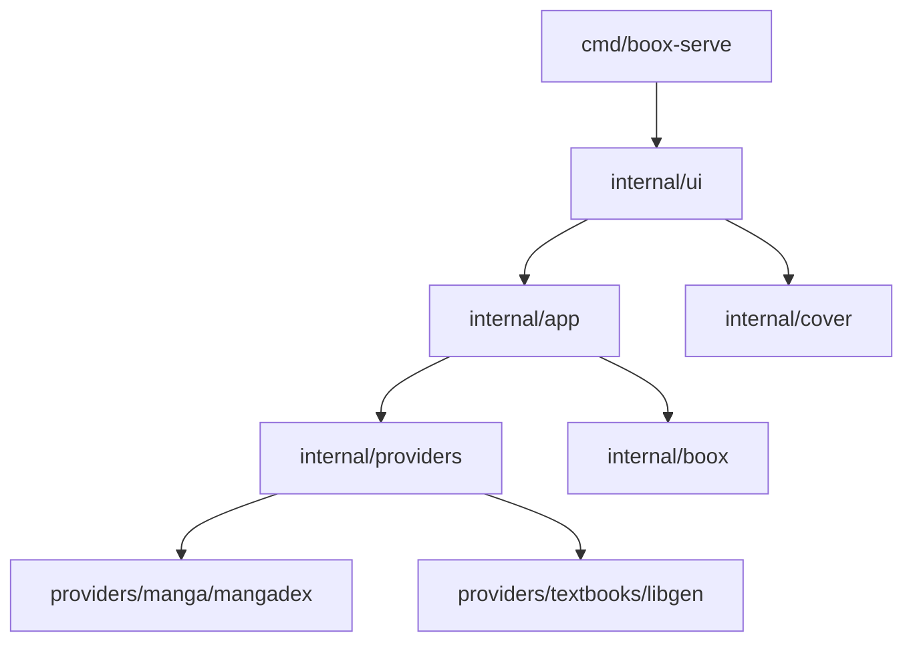

# Boox Serve

Boox Serve is a terminal UI for finding manga and pushing CBZ files to a Boox device over your local network. It keeps provider-specific logic behind interfaces so the UI stays stable while sources evolve.

## What it does

- Search MangaDex and pick chapters to download
- Build CBZ archives and upload them to your device
- Cache and preview covers in Kitty-compatible terminals
- Keep provider logic isolated under `internal/providers`

## Quick start

```bash
go run ./cmd/boox-serve
```

Build a binary:

<<<<<<< HEAD
=======
```bash
go build ./cmd/boox-serve
```

## Configuration

Boox Serve reads an optional `.env` file from the user config directory, then loads `config.json`. Config values override `.env` values; env values only fill in missing fields.

Config locations:

- macOS: `~/Library/Application Support/boox-serve/config.json`
- Linux: `~/.config/boox-serve/config.json`
- Windows: `%AppData%\boox-serve\config.json`

`.env` lives in the same directory.

Example `config.json`:

```json
{
  "boox_url": "http://192.168.1.10",
  "boox_ip": "",
  "boox_port": 8085,
  "verbose": false,
  "providers": {
    "mangadex_api_key": "your-key"
  }
}
```

Example `.env`:

```bash
BOOX_TABLET_URL=http://192.168.1.10
BOOX_TABLET_PORT=8085
BOOX_MANGADEX_API_KEY=your-key
BOOX_VERBOSE=true
```

## Architecture



Provider contract (manga):

```go
type Provider interface {
  Search(ctx context.Context, query string) ([]SearchResult, error)
  FetchChapters(ctx context.Context, mangaID string) ([]Chapter, error)
  DownloadChapterImages(ctx context.Context, chapter Chapter) ([][]byte, error)
  FetchCover(ctx context.Context, coverURL string) ([]byte, error)
}
```

## Adding a new provider

1. Implement the provider interface under `internal/providers/...`.
2. Wire it in `cmd/boox-serve/main.go`.
3. Add any new keys to `internal/config` and the README example.

## Development

```bash
go test ./...
```

## Notes

- Cover previews require a Kitty-compatible terminal (Kitty, Ghostty, etc.).
- MangaDex API keys can be set in config or via `BOOX_MANGADEX_API_KEY`.
>>>>>>> 42d59aa (Updated README)
